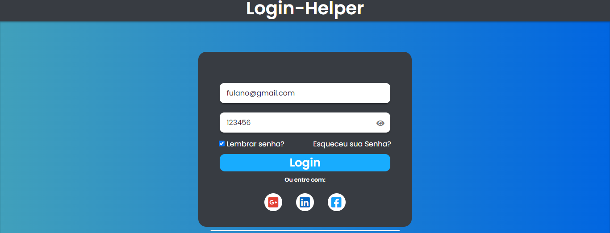

# Login-Helper
Sign Up page using HTML, CSS and JAVASCRIPT.
 
This project was made for a practical study.

***WEB VERSION*** 

 
 
>
 
 

## 🚀 Starting

To start the project, just open the file `index.html` in your preferred browser.

---
##### coded by Cadu Soares
